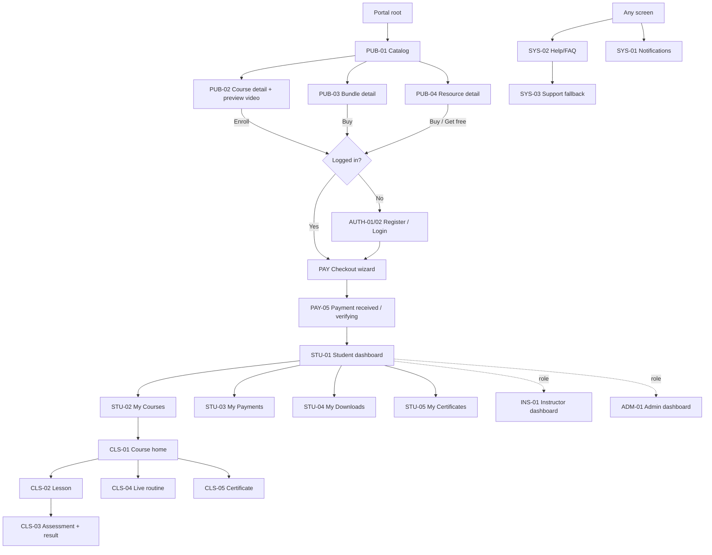
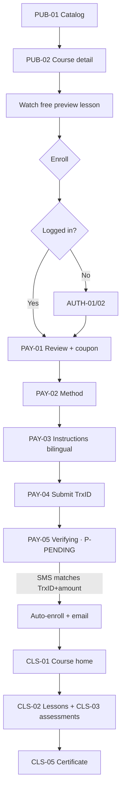

# ArefinLab Student Portal — App Flow Document

| | |
|---|---|
| **Product** | ArefinLab Student Portal |
| **Document** | App Flow — screen map, navigation & user journeys |
| **Version** | v0.1 — Draft for review |
| **Companion** | BRD/PRD v0.1 (requirement IDs referenced as `FR-*`) |
| **Owner** | Sadot Arefin |
| **Audience** | Product, design, engineering |

---

> **Agent/build note (Claude Code):** Part of a build-ready set — read **`CLAUDE.md`** first, then the **Tech Stack (v0.2, version-locked)**. The screen IDs here (`PUB-*, AUTH-*, PAY-*, STU-*, CLS-*, INS-*, ADM-*, SYS-*`) map to routes under `src/app/**` and pair with the PRD's `FR-*` IDs as the task backbone.

## 1. How to read this document

- **Screen IDs** use area prefixes: `PUB` (public), `AUTH`, `PAY` (checkout/payment), `STU` (student), `CLS` (classroom/learning), `INS` (instructor), `ADM` (admin), `SYS` (system/global).
- Every screen spec lists: **Purpose · Entry points · Key elements · Empty/no-data · Loading · Error · Exits.**
- To avoid repetition, recurring states are defined once in **§4 State Pattern Library** (`P-*`) and referenced by ID. A screen with `Empty: P-EMPTY` uses the standard empty pattern; screens with unusual states describe them inline.

---

## 2. Design principles (drive every screen)

1. **No-support-calls first.** Any screen where a novice could get confused — checkout, pending payment, payment errors, locked content — carries plain-language reassurance, a self-serve next action, and an **async support fallback** (`P-SUPPORT`). A user should never hit a dead end that makes calling feel necessary.
2. **Every screen has four states**, always designed, never an afterthought: *loaded · loading · empty · error*.
3. **Mobile-first PWA.** Bottom tab bar on mobile, sidebar on desktop; data-saver video; skeletons over spinners.
4. **Bilingual where it de-risks money.** UI is English; **payment instructions and payment-status copy are English + Bangla/Banglish**.
5. **Public browse, gated action.** Catalog, course detail (incl. preview videos), bundles, and resources are viewable without an account; an account is required only at enroll/checkout and to access full content.

---

## 3. Global navigation & shell

### 3.1 Layouts

- **Standard shell (desktop):** left sidebar (primary nav) · top bar (search, notification bell, help, profile) · content area.
- **Standard shell (mobile):** bottom tab bar (Home · Courses · Payments · Notifications · Profile) · top bar (context title, search, bell) · content.
- **Classroom shell:** replaces standard nav when inside a course — collapsible **syllabus rail** (left) + **content pane** (right) + slim top bar with breadcrumb and progress; an **Exit to dashboard** control. Mobile collapses the syllabus rail into a drawer.

### 3.2 Persistent elements

- **Resume shortcut** — "Continue where you left off" on the student home and top bar (`FR-DSH-3`).
- **Notification bell** (`SYS-01`) — in-app mirror of key emails (payment verified, class reminder, overdue, waitlist open, certificate).
- **Help entry** (`SYS-02`) — always reachable; surfaced *inline* on checkout, pending, and error screens.
- **Breadcrumbs** — on all nested pages.

### 3.3 Navigation map

---

## 4. State Pattern Library (reusable)

| ID | Pattern | Definition |
|---|---|---|
| **P-LOAD** | Loading | Skeleton matching the final layout (cards, list rows, player frame). No blank-screen spinners. |
| **P-EMPTY** | Empty / no data | Icon + one-line explanation + **single primary action**. Never a dead end. |
| **P-ERROR** | Recoverable error | Calm plain-language message, **"Try again"**, and **"Get help"** (`SYS-03`). No codes/stack traces shown. |
| **P-PENDING** | Verifying / pending payment | Reassurance: *"Payment received. Our system is verifying — you'll get an email within [X]. No need to call or message."* + status chip + **"Recheck status"** + expected time + support link. Bilingual. |
| **P-LOCKED** | Locked / drip content | Item visible but greyed with lock icon + **unlock date/countdown** + tooltip reason. |
| **P-READONLY** | Deactivated / read-only course | Top banner: *"This course is closed for new activity; your content stays available."* Interactions (submit/quiz) disabled. |
| **P-SUPPORT** | Support fallback block | *"Still stuck? Message us on WhatsApp or send a request — we reply within [X]."* Rendered on checkout, pending, all payment errors, and Help. |
| **P-OFFLINE** | Offline (PWA) | Cached shell + "You're offline" + retry. Video unavailable offline in MVP. |
| **P-FORBIDDEN** | Access denied | Explains auth/role requirement + route to login or dashboard. |

---

## 5. Screen inventory

| ID | Screen | Area | Auth | Roles | Notes |
|---|---|---|:--:|---|---|
| PUB-01 | Catalog / course listing | Public | No | All | Effective home when logged out; search + filters |
| PUB-02 | Course detail (+ preview video) | Public | No | All | Outcomes, syllabus, 1–2 **free-preview** lessons, price, enroll CTA |
| PUB-03 | Bundle detail | Public | No | All | Included courses, bundle price, auto-enroll note |
| PUB-04 | Resource detail | Public | No | All | Paid/free digital product |
| PUB-05 | Search results | Public | No | All | Incl. no-results state |
| AUTH-01 | Register | Auth | — | Student | Email/password + Google |
| AUTH-02 | Login | Auth | — | All | Email/password + Google |
| AUTH-03 | Email verification | Auth | Partial | Student | Pending + success |
| AUTH-04 | Forgot / reset password | Auth | — | All | Signed link |
| AUTH-05 | First-login guided tour | Onboarding | Yes | Student | Dismissible overlay |
| PAY-01 | Checkout · Review + coupon | Payment | Yes | Student | Items, coupon/referral field |
| PAY-02 | Checkout · Method select | Payment | Yes | Student | bKash / Nagad / Bank Transfer |
| PAY-03 | Checkout · Transfer instructions | Payment | Yes | Student | **Bilingual**; bank distinct |
| PAY-04 | Checkout · Submit transaction ID | Payment | Yes | Student | TrxID + amount + sender |
| PAY-05 | Payment received / verifying | Payment | Yes | Student | `P-PENDING`; course locked |
| PAY-06 | "I already paid — submit TrxID" | Payment | Yes | Student | Off-form/direct entry point |
| STU-01 | Student dashboard | Student | Yes | Student | Resume, upcoming, dues, complete-enrollment card |
| STU-02 | My Courses | Student | Yes | Student | Enrolled list |
| STU-03 | My Payments | Student | Yes | Student | Paid / due / overdue + pay-now |
| STU-04 | My Downloads | Student | Yes | Student | Purchased resources; link recovery |
| STU-05 | My Certificates | Student | Yes | Student | Verify links |
| STU-06 | Profile & settings | Student | Yes | All | Video data-saver default here too |
| CLS-01 | Course home (classroom) | Learning | Yes | Enrolled | Syllabus, progress, announcements, routine |
| CLS-02 | Lesson view | Learning | Yes | Enrolled | Ordered mixed blocks; mark complete/next |
| CLS-03 | Assessment + result | Learning | Yes | Enrolled | MCQ + AI short-answer; score, feedback, retry |
| CLS-04 | Live routine / calendar | Learning | Yes | Enrolled | Join buttons; recordings attach post-session |
| CLS-05 | Certificate screen | Learning | Yes | Enrolled | Shareable verify link |
| INS-01 | Instructor dashboard | Instructor | Yes | Instructor | Courses, students, to-grade |
| INS-02 | Course builder | Instructor | Yes | Instructor | Modules/submodules/lessons/blocks (simple) |
| INS-03 | Roster & attendance | Instructor | Yes | Instructor | Per-session checklist |
| INS-04 | Grading queue | Instructor | Yes | Instructor | AI grade + inline override |
| INS-05 | Announcements | Instructor | Yes | Instructor | Broadcast to cohort |
| INS-06 | Messaging | Instructor | Yes | Instructor | Message students |
| ADM-01 | Admin dashboard | Admin | Yes | Admin | Revenue, queue count, at-risk, enrollments |
| ADM-02 | Verification queue | Admin | Yes | Admin | Approve/reject; match view |
| ADM-03 | Manual ledger entry | Admin | Yes | Admin | Off-form/direct payments |
| ADM-04 | Reconciliation report | Admin | Yes | Admin | Ledger vs. received transactions |
| ADM-05 | User management | Admin | Yes | Admin | Ban-from-course / suspend |
| ADM-06 | Course lifecycle | Admin | Yes | Admin | Create / archive / deactivate |
| ADM-07 | Coupons & referrals | Admin | Yes | Admin | Codes, caps, expiry |
| ADM-08 | Bundle setup | Admin | Yes | Admin | Group courses, price, window |
| ADM-09 | Resource management | Admin | Yes | Admin | Upload digital products |
| ADM-10 | Testimonial approval | Admin | Yes | Admin | Approve/reject submissions |
| ADM-11 | Enroll on behalf | Admin | Yes | Admin | Manual enrollment |
| ADM-12 | Audit log viewer | Admin | Yes | Admin | Financial/access mutations |
| SYS-01 | Notification center | Global | Yes | All | Bell |
| SYS-02 | Help / FAQ | Global | No | All | Incl. "How payment works" (bilingual) |
| SYS-03 | Support fallback | Global | No | All | WhatsApp link / request form |
| SYS-04 | 404 / not found | Global | No | All | — |
| SYS-05 | Offline | Global | — | All | `P-OFFLINE` |
| SYS-06 | PWA install prompt | Global | No | All | Contextual banner |
| SYS-07 | Global error | Global | — | All | `P-ERROR` full-page |
| SYS-08 | Waitlist "notify me" | Global | No | All | Modal |
| SYS-09 | Free-resource email capture | Global | No | All | Modal |

---

## 6. Screen specifications

> Compact spec format. States not listed use the referenced `P-*` pattern. Critical-path screens are expanded.

### 6.1 Public

**PUB-01 · Catalog / course listing**
- *Purpose:* Discover courses, bundles, resources; the logged-out home.
- *Entry:* Portal root; marketing-site links; nav "Courses".
- *Key elements:* Search bar, filters (type: live/recorded/text/mixed; price; free/paid), course cards (title, outcome teaser, type badge, price), sections for Bundles and Resources.
- *Empty:* If catalog genuinely empty → `P-EMPTY` ("New courses coming soon" + notify-me `SYS-08`). Normally never empty.
- *Loading:* `P-LOAD` card skeletons. *Error:* `P-ERROR`. *Exits:* PUB-02/03/04, PUB-05.

**PUB-02 · Course detail (+ preview video)** *(expanded)*
- *Purpose:* Convert a visitor; convey outcomes and structure; let them **sample the teaching**.
- *Entry:* PUB-01, search, marketing links.
- *Key elements:* Title, **learning outcomes** (`FR-CRS-4`), type badge, price/installment note, instructor(s), full **syllabus tree** (modules/submodules/lessons) with lessons marked locked, **1–2 lessons flagged "Free preview"** that play inline without login. End-of-preview overlay: *"Enjoyed this? Enroll to unlock the full course."* Enroll CTA (sticky on mobile). Testimonials (approved). For live cohorts: start date + routine summary + **waitlist** if full/upcoming (`SYS-08`).
- *Empty/no-data:* Course still being built → syllabus shows "Content coming soon" placeholders; if live cohort not yet dated, show "Dates announced soon" + notify-me.
- *Loading:* `P-LOAD`. *Error:* `P-ERROR`. *Exits:* Checkout (via auth gate), waitlist modal, back to catalog.

**PUB-03 · Bundle detail** — *Purpose:* sell a course group. *Key elements:* included courses (linking to each PUB-02), bundle price + savings, **auto-enroll note** (`FR-PRO-1`), availability window. *States:* standard. *Exits:* checkout.

**PUB-04 · Resource detail** — *Purpose:* sell/deliver a standalone digital product. *Key elements:* preview/description, paid → price + buy; free → email-capture (`SYS-09`); delivery note (signed expiring link). *Exits:* checkout (paid) or capture modal (free).

**PUB-05 · Search results** — *Key elements:* result cards across courses/bundles/resources. *Empty (no results):* `P-EMPTY` with suggestions ("Try broader terms" + popular courses). *States:* standard.

### 6.2 Auth & onboarding

**AUTH-01 · Register** — email/password + Google. *Error:* inline field validation; duplicate-email guidance (route to login/reset). *Exit:* email verification, then resume checkout if pending, else STU-01.

**AUTH-02 · Login** — email/password + Google; forgot-password link. *Error:* generic "email or password incorrect"; lockout guidance → `SYS-03`.

**AUTH-03 · Email verification** — pending screen (resend link, check-spam note) + success. *No-data:* if link expired → "Request a new link".

**AUTH-04 · Forgot / reset** — request + reset via signed link; expired-link recovery.

**AUTH-05 · First-login guided tour** — dismissible overlay highlighting: Resume, My Payments, Help, and "how enrollment & payment works". Skippable; re-openable from Help.

### 6.3 Checkout & payment *(critical path — expanded)*

**PAY-01 · Checkout · Review + coupon**
- *Key elements:* item(s) with price; **coupon/referral field** (`FR-PRO-3/4`); installment selector if the course allows (shows full plan + "you pay installment 1 now"); total.
- *Error:* invalid/expired coupon → inline non-blocking message; item no longer available → remove + explain.
- *Exit:* PAY-02.

**PAY-02 · Checkout · Method select** — bKash / Nagad / **Bank Transfer** (visually distinct: "manual confirmation, may take longer"). *Exit:* PAY-03.

**PAY-03 · Checkout · Transfer instructions** *(bilingual)*
- *Key elements:* exact **amount**, destination number/account, step-by-step **in English + Bangla/Banglish**, a "how it works" line ("after you pay, submit your Transaction ID on the next step; we verify automatically"), copy-to-clipboard on number/amount.
- *Support:* `P-SUPPORT` present. *Exit:* PAY-04.

**PAY-04 · Checkout · Submit transaction ID**
- *Key elements:* TrxID field, amount, sender number; format hint; confirm.
- *Error/validation:* inline format check before submit; on submit, create pending record.
- *Duplicate TrxID:* specific, non-alarming message — *"This transaction ID is already recorded. If this is yours and you haven't been enrolled, submit a request and we'll check."* + editable field + `P-SUPPORT`.
- *Exit:* PAY-05.

**PAY-05 · Payment received / verifying** *(no-call anchor)*
- *State:* `P-PENDING`. Course appears in My Courses **locked** with a "Verifying" chip.
- *Sub-states:*
  - *Auto-verified quickly:* transitions to success + email; course unlocks.
  - *Not matched within window:* copy shifts to *"Still verifying — now being checked by our team. No action needed unless we email you."* "Recheck status" + `P-SUPPORT`.
  - *Amount mismatch:* *"We received a payment but the amount doesn't match. We'll reconcile this — submit a request if urgent."* + guidance.
- *Exit:* STU-01 / CLS-01 on success.

**PAY-06 · "I already paid — submit transaction ID"**
- *Purpose:* off-form/direct buyers self-serve instead of calling.
- *Entry:* Help, catalog, and course detail ("Paid directly? Submit your Transaction ID").
- *Key elements:* pick the course/resource, then the same TrxID form (PAY-04), feeding the **same verification queue** (`FR-VER-7`).
- *Empty/first-use:* explains who this is for. *Exit:* PAY-05.

### 6.4 Student area

**STU-01 · Student dashboard** *(expanded)*
- *Key elements:* **Resume** card; **upcoming live classes** (with join when near); **outstanding payments** alert (due/overdue) with pay-now; **"Complete your enrollment"** card for any abandoned checkout (`FR-VER-10`); recently added content.
- *Empty (new user, no enrollments):* `P-EMPTY` → hero "Browse courses" + how-it-works link + guided-tour re-entry. No blank screen ever.
- *Loading:* `P-LOAD`. *Error:* `P-ERROR`. *Exits:* everywhere.

**STU-02 · My Courses** — enrolled list with progress bars; locked (verifying) and read-only (deactivated) courses shown with their banners. *Empty:* `P-EMPTY` → browse.

**STU-03 · My Payments** *(no-call anchor)*
- *Key elements:* tabs Paid / Due / Overdue; each installment with status; **"Pay now"** on due/overdue → checkout for that installment; refunds shown as entries; each pending payment links to its PAY-05 tracker.
- *Empty:* `P-EMPTY` ("No payments yet").
- *Overdue:* highlighted but **not** access-restricting (`FR-PAY-5`); reminder mirrors here and in the bell.

**STU-04 · My Downloads** — purchased resources with download buttons. *Expired link:* not a dead link — **"Link expired — regenerate"** action, with `P-SUPPORT` fallback. *Empty:* `P-EMPTY` → browse resources.

**STU-05 · My Certificates** — issued certificates with public verify links + share. *Empty:* `P-EMPTY` ("Complete a course to earn your first certificate").

**STU-06 · Profile & settings** — account, password, **video data-saver / default quality**, notification preferences, language (English now; Bangla later).

### 6.5 Classroom / learning

**CLS-01 · Course home** — syllabus rail (modules→lessons with progress, `P-LOCKED` for drip), announcements, live routine entry, outcomes, certificate progress. *Read-only course:* `P-READONLY` banner. *Empty (content not built yet):* "Coming soon" placeholders + (live) start date. *Exits:* CLS-02/03/04/05.

**CLS-02 · Lesson view** *(expanded)*
- *Key elements:* single scrollable page rendering **ordered blocks** (video / text / file / inline assessment); Bunny player with **resume position** (`FR-PRG-2`), **data-saver/quality selector**, and **email watermark**; footer **"Mark complete → Next"**; prev/next nav; syllabus rail highlight.
- *Empty:* lesson with no blocks yet → "Content coming soon".
- *Locked/drip:* `P-LOCKED` with unlock date if reached out of order.
- *Loading:* `P-LOAD` (player frame skeleton). *Error:* video load fail → `P-ERROR` with retry + quality downgrade suggestion + `P-SUPPORT`.
- *Exits:* next lesson, assessment, course home.

**CLS-03 · Assessment + result** — inline MCQ (auto-graded) + short-answer (AI-graded). Result screen: score + **AI feedback**; **retry** if allowed; instructor-override note if a grade was adjusted. *Gating:* if required-to-progress, next lesson stays `P-LOCKED` until pass. *Error:* submission failure → autosave + retry.

**CLS-04 · Live routine / calendar** — upcoming/past sessions (tz-aware), **Join** buttons (active near start), recordings attached to each past session's lesson. *Empty:* "No sessions scheduled yet".

**CLS-05 · Certificate screen** — certificate render + **public verify link** + share. Reached on completion.

### 6.6 Instructor

**INS-01 · Instructor dashboard** — own courses, student counts, **to-grade** queue, recent announcements. *Empty (new instructor):* `P-EMPTY` → "Create your first course" (INS-02).

**INS-02 · Course builder** — tree editor: modules → submodules → lessons → **blocks** (add video via Bunny, text, file, assessment); set drip schedule, completion rules, preview-lesson flags, outcomes. *Empty:* guided "add your first module". *Error/autosave:* draft autosave + save-failed retry. *Scope:* functional, not fancy (Phase 1).

**INS-03 · Roster & attendance** — per-session **checklist** to mark present (registers progress). *Empty:* "No students enrolled yet" / "No sessions yet".

**INS-04 · Grading queue** — pending short-answer submissions with **AI grade + feedback**, editable **inline override** (audit-logged). *Empty:* "Nothing to grade — you're caught up."

**INS-05 · Announcements** — compose → broadcast to a cohort (email + in-app). *INS-06 · Messaging* — message students; standard empty/error.

### 6.7 Admin

**ADM-01 · Admin dashboard** — revenue summary, **verification-queue count**, at-risk (overdue) students, enrollment trend, quick links. *Empty (pre-launch):* `P-EMPTY` with setup checklist.

**ADM-02 · Verification queue** *(operational core)* — pending submissions with a **match view** (submitted TrxID/amount vs. received transactions), Approve / Reject, reason capture; bank-transfer and mismatch items surfaced here (`FR-VER-6`). *Empty:* "Queue clear." *Error:* action failure → retry, no double-approve (idempotent).

**ADM-03 · Manual ledger entry** — record an off-form/direct payment against student+course; audit-logged. **ADM-04 · Reconciliation report** — ledger vs. received transactions, flag discrepancies.

**ADM-05 · User management** — search users; **ban-from-course** / **suspend account** (reversible, progress retained); view history. *Confirm dialogs* on destructive actions.

**ADM-06 · Course lifecycle** — create, **archive** (soft), **deactivate for students** (read-only). **ADM-07 · Coupons & referrals** — codes, discount, caps, expiry. **ADM-08 · Bundle setup** — group courses, price, window. **ADM-09 · Resource management** — upload digital products, set price/free, watermark, download policy. **ADM-10 · Testimonial approval** — approve/reject. **ADM-11 · Enroll on behalf** — manual enroll. **ADM-12 · Audit log** — filterable log of financial/access mutations.

### 6.8 System / global

- **SYS-01 Notification center** — grouped list; empty → "You're all caught up."
- **SYS-02 Help / FAQ** — searchable; a prominent **"How enrollment & payment works"** (bilingual, with screenshots) and **"I paid but nothing happened"** article routing to PAY-06 / `P-PENDING` explanation.
- **SYS-03 Support fallback** — WhatsApp link + request form with expected reply time.
- **SYS-04 404**, **SYS-05 Offline** (`P-OFFLINE`), **SYS-06 PWA install prompt** (contextual, dismissible), **SYS-07 Global error** (`P-ERROR` full-page), **SYS-08 Waitlist modal**, **SYS-09 Free-resource capture modal**.

---

## 7. Core user journeys

### J1 · Visitor → enroll → auto-verified → learn → complete *(primary)*

### J2 · Off-form / direct buyer → self-serve verify
1. Buyer pays directly (talked to Sadot, or via a special Google Form).
2. Enters via **PAY-06** ("I already paid") from Help/catalog → selects course → submits TrxID (PAY-04).
3. Lands in **PAY-05** pending; same verification queue resolves it. *No call needed.*

### J3 · Manual / bank / mismatch → admin approves
1. Student submits TrxID (PAY-04) → **PAY-05** pending.
2. No auto-match (bank transfer, timeout, or amount mismatch) → item appears in **ADM-02** queue.
3. Admin reviews match view → Approve → student auto-enrolled + emailed; PAY-05 flips to success.
4. Reject → student notified with reason + `P-SUPPORT` path.

### J4 · Abandoned checkout → resume
1. Student reaches PAY-03/04 but never submits TrxID.
2. **"Complete your enrollment"** card appears on **STU-01** + reminder email (`FR-VER-10`).
3. Tap resumes the wizard where they left off.

### J5 · Installment → pay-now
1. Student enrolled via installment (full access on installment 1, `FR-PAY-2`).
2. Next installment shows as **Due** in **STU-03** (and bell/email reminders as it approaches/passes).
3. "Pay now" → checkout for that installment → PAY-05 → ledger updates. Overdue never blocks access (`FR-PAY-5`).

### J6 · Free resource capture
1. **PUB-04** free resource → **SYS-09** email capture → signed link delivered + available in **STU-04**.

### J7 · Instructor: build → attendance → grade
1. **INS-02** build course tree (blocks, drip, preview flags, outcomes).
2. Live session runs → **INS-03** mark attendance (registers progress).
3. Short answers arrive → **INS-04** review AI grade, override if needed (audit-logged).

### J8 · Admin: verify → ledger → reconcile
1. **ADM-02** clear verification queue (approve/reject).
2. **ADM-03** enter any direct/off-form payments.
3. **ADM-04** run reconciliation; investigate flagged discrepancies via **ADM-12** audit log.

### J9 · Ban / suspend
1. **ADM-05** ban-from-course or suspend account (confirm dialog).
2. Student sees the affected course/account restricted with a clear reason; **progress retained**; reversible. No auto-refund (handled in ledger if applicable).

---

## 8. Cross-cutting: notification triggers (in-app + email)

| Event | In-app (SYS-01) | Email (Resend) |
|---|:--:|:--:|
| Enrollment confirmed / payment verified | ✅ | ✅ |
| Payment still verifying (team review) | ✅ | ✅ |
| Installment reminder / overdue | ✅ | ✅ |
| Abandoned-checkout nudge | ✅ | ✅ |
| Class reminder | ✅ | ✅ |
| Waitlist opened | ✅ | ✅ |
| Certificate issued | ✅ | ✅ |
| Ban / suspension | ✅ | ✅ |
| Testimonial approved | ✅ | — |

---

## 9. MVP guardrails (kept out of this flow, by design)

Per-lesson discussion, video timestamp notes, gift/enroll-someone-else, multi-device session limits, course ratings, in-portal USD checkout, full Bangla UI, native apps, TA/sub-admin roles. These are **Phase 2** and are not mapped here.

---

## 10. Open items

All prior product questions were resolved to defaults. Design-time items to confirm during build:
- Exact **expected-verification-time** copy for `P-PENDING` (e.g., "within a few hours") — set a realistic promise you can keep.
- **Support fallback** channel and reply-time SLA for `P-SUPPORT` (WhatsApp vs. request form).
- Final **bilingual payment copy** (English + Bangla/Banglish) for PAY-03 and the Help "how payment works" article.

---

*End of App Flow v0.1 — Draft for review.*
