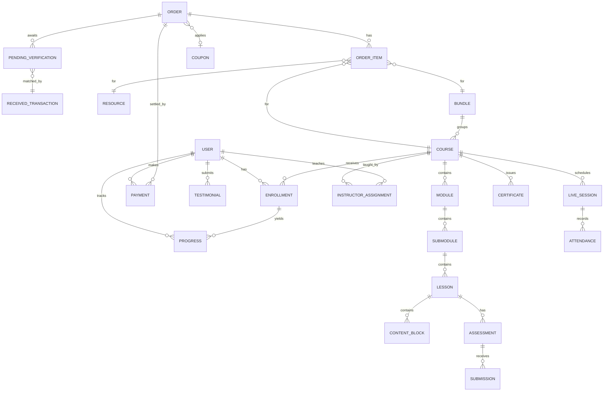
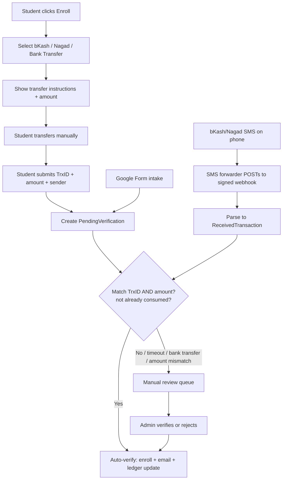

# ArefinLab Student Portal — Business & Product Requirements Document (BRD/PRD)

| | |
|---|---|
| **Product** | ArefinLab Student Portal |
| **Document** | BRD / PRD (combined) |
| **Version** | v0.1 — Draft for review |
| **Status** | Requirements confirmed; pending final sign-off |
| **Owner** | Sadot Arefin |
| **Audience** | Product, engineering, and delivery |

---

> **Agent/build note (Claude Code):** This document is part of a build-ready set — read **`CLAUDE.md`** first, then the **Tech Stack (v0.2, version-locked)** and **App Flow**. The requirement IDs below (`FR-<MODULE>-<n>`) are the task backbone: reference them in commits/PRs. Product behavior comes from this doc; build/process rules come from `CLAUDE.md`.

## 1. Executive summary

The ArefinLab Student Portal is a two-sided learning platform that delivers courses (live cohort, recorded, text-based, and mixed), tracks student progress, sells standalone digital resources, and — critically — runs a **manual-plus-automated payment verification system** built around bKash, Nagad, and bank transfer, since external payment gateways are not yet available.

The platform is the productized successor to the current manual enrollment and verification workflow. It must launch lean (clean build, leads/enrollments reaching the system, payment instructions visible, deployed to domain) and expand from there. Over-engineering is explicitly out of scope for v1.

**Core positioning carried into the product:** production-grade rigor, human judgment over raw AI output, deterministic system integrity. This shows up concretely in the ledger's audit trail, the payment-matching safeguards, and the instructor override on AI grading.

---

## 2. Goals & success metrics

| Goal | Metric |
|---|---|
| Enable self-service enrollment | % of enrollments completed without manual admin contact |
| Reduce payment-verification effort | % of bKash/Nagad payments auto-verified vs. manually verified |
| Reliable content delivery on BD mobile networks | Video start time; buffering ratio; playback error rate |
| Course completion / retention | Lesson completion rate; cohort attendance rate |
| Revenue tracking integrity | Ledger reconciliation discrepancies (target: 0) |

---

## 3. Scope

### 3.1 In scope (v1 launch)
- Three roles: Admin, Instructor, Student, with co-instructors per course.
- Course structure (course → module → submodule → lesson → content blocks) supporting video, text, file, and assessment blocks — covering recorded, text-based, live cohort, and mixed formats.
- Video hosting via Bunny Stream with resume-position tracking and signed playback.
- Progress tracking, including live-cohort attendance as progress.
- Assessments: MCQ (auto-graded) and short-answer (AI-graded with instructor override).
- Certificates of completion (verifiable link).
- Enrollment lifecycle: perpetual access, soft-archive, course deactivation, ban-from-course, account suspension — all preserving progress.
- Payments: manual admin ledger, self-service cart (bKash / Nagad / bank transfer), installments, refunds, coupons/referrals.
- Automated bKash/Nagad transaction verification engine with manual fallback queue.
- Standalone digital resource storefront (paid + free) with signed, expiring, watermarked downloads.
- Bundles and promotions.
- Testimonials (student-submitted, admin-approved).
- Notifications (email via Resend + in-app), including class reminders and abandoned-payment nudges.
- Role-based dashboards.
- Audit log on all ledger/enrollment mutations.

### 3.2 Out of scope (v1) — planned later
- TA / sub-admin granular roles.
- Per-lesson Q&A / discussion threads.
- Video timestamp notes/bookmarks.
- Gift / enroll-someone-else.
- Multi-device concurrent-session limits.
- Course ratings.
- Native mobile apps (v1 is a responsive PWA).
- Full Bangla localization (v1 ships English; the system is i18n-ready).
- USD in-portal checkout (international sales stay on the existing Gumroad line, tracked separately).
- External payment gateway integration (Stripe/PayPal/merchant bKash) — the manual + auto-SMS flow is the deliberate bridge.

---

## 4. Personas & roles

| Persona | Description | Primary needs |
|---|---|---|
| **Admin** | Platform owner/operator | Full control; manual payment entry; verification queue; reconciliation; content and user management |
| **Instructor** | Course author & teacher (co-instructors allowed) | Author content; mark attendance; grade / override AI grades; message and view roster |
| **Student** | Enrolled learner (local + diaspora) | Enroll; consume content; track progress; view payment history and dues; download resources |

### 4.1 Role-based access control (RBAC) matrix

| Capability | Admin | Instructor | Student |
|---|:---:|:---:|:---:|
| Manage all users & roles | ✅ | ❌ | ❌ |
| Create / edit own course & content | ✅ | ✅ (own courses) | ❌ |
| Add co-instructor to a course | ✅ | ✅ (own courses) | ❌ |
| View course roster | ✅ | ✅ (own courses) | ❌ |
| Mark attendance | ✅ | ✅ (own courses) | ❌ |
| Grade / override AI grade | ✅ | ✅ (own courses) | ❌ |
| Message students | ✅ | ✅ (own courses) | ❌ |
| View revenue / ledger | ✅ | ❌ | ❌ |
| Enter/verify payments manually | ✅ | ❌ | ❌ |
| Access deactivated/archived course content | ✅ | ✅ (own courses) | Read-only (deactivated) |
| Enroll in courses | ✅ (on behalf) | ❌ | ✅ |
| Consume content & track own progress | ✅ | ✅ | ✅ |
| View own payment history & dues | ✅ | ✅ | ✅ |
| Submit testimonial | ❌ | ❌ | ✅ |
| Approve testimonial | ✅ | ❌ | ❌ |

---

## 5. Functional requirements

Requirement IDs are grouped by module (`FR-<MODULE>-<n>`). "Configurable" means an admin/instructor setting, not hard-coded.

### 5.1 Accounts & authentication (ACC)
- **FR-ACC-1** Students can self-register (email + password) and verify email.
- **FR-ACC-2** Admin can create instructor and admin accounts; instructors cannot self-register.
- **FR-ACC-3** Admin can enroll a student on their behalf (for direct/off-form sales).
- **FR-ACC-4** Account suspension freezes login but retains all progress and payment data; reversible by admin.
- **FR-ACC-5** Password reset via emailed signed link (Resend).
- **FR-ACC-6** All user/enrollment/payment mutations write to an immutable audit log (actor, action, before/after, timestamp).

### 5.2 Course structure & content (CRS)
- **FR-CRS-1** Course types: **Live Cohort**, **Recorded**, **Text-based**, **Mixed**.
- **FR-CRS-2** Hierarchy: Course → Module → Submodule → Lesson. A **Lesson is composed of ordered content blocks**.
- **FR-CRS-3** Content block types: **Video**, **Text/Article**, **File/Download**, **Assessment (MCQ + short-answer)**. Any combination in one lesson supports the "mixed" case (article with an explanatory video lecture inline).
- **FR-CRS-4** Each course captures **learning outcomes** as a first-class, displayed field.
- **FR-CRS-5** Each course can define a **syllabus** view auto-generated from its module/submodule/lesson tree.
- **FR-CRS-6** A course can attach an **eBook**, a **class routine**, and **additional resources** (text + links).
- **FR-CRS-7** Live-cohort recorded videos are linked to the corresponding lesson after each session (Bunny library).
- **FR-CRS-8** **Drip scheduling**: modules/lessons can be set to unlock on a schedule (absolute date or relative to enrollment/cohort start).
- **FR-CRS-9** **Soft archive**: an archived course is hidden from catalog and student views but retained and admin-visible.
- **FR-CRS-10** **Deactivate for all students**: students retain **read-only** access to previously available content; instructors and admins retain full access; no new enrollments.

### 5.3 Content delivery & progress tracking (PRG)
- **FR-PRG-1** Video is delivered via Bunny Stream with adaptive bitrate, signed/token playback, and domain lock.
- **FR-PRG-2** A per-user, per-lesson **resume position** is saved from player time-update events and restored on load.
- **FR-PRG-3** **Completion rules** (configurable per course, with defaults): video ≥ **90%** watched; article marked read manually; quiz **passed**; live class **attended**.
- **FR-PRG-4** Module/course completion is derived from constituent lesson completion.
- **FR-PRG-5** A **dynamic watermark** (student email/ID overlay) is rendered on video as a light anti-piracy deterrent.
- **FR-PRG-6** Progress is preserved through suspension, ban, archive, and deactivation.

### 5.4 Live cohort management (LIVE)
- **FR-LIVE-1** Each live session stores a meeting link (Zoom/Google Meet) and scheduled datetime with **timezone** support.
- **FR-LIVE-2** **Attendance is marked by the instructor**; marking attendance registers session progress for the student.
- **FR-LIVE-3** A **class routine / calendar** view shows upcoming sessions per enrolled cohort.
- **FR-LIVE-4** **Class reminders** are emailed ahead of each session (configurable lead time).

### 5.5 Assessments & AI grading (ASM)
- **FR-ASM-1** Assessments can be attached at **lesson or module** level.
- **FR-ASM-2** **MCQ** questions are auto-graded instantly.
- **FR-ASM-3** **Short-answer** questions are graded by AI, returning a **score plus written feedback**.
- **FR-ASM-4** Instructors can **review and override** any AI grade; the override is audit-logged.
- **FR-ASM-5** Gating is **configurable per course**: assessments may be optional or required-to-progress (default: optional).
- **FR-ASM-6** Assessment results feed both progress and certificate eligibility.

### 5.6 Certificates (CERT)
- **FR-CERT-1** On course completion (per its completion rules), a **certificate** is issued.
- **FR-CERT-2** Each certificate has a **public verifiable link** with a unique ID.

### 5.7 Enrollment lifecycle (ENR)
- **FR-ENR-1** Enrollment grants **perpetual access** by default (never expires).
- **FR-ENR-2** A student can be **banned from a specific course** (loses that course's access, keeps everything else and all progress); reversible.
- **FR-ENR-3** **Account suspension** blocks all access (see FR-ACC-4); reversible.
- **FR-ENR-4** Neither ban nor suspension triggers an automatic refund; refunds are handled explicitly in the ledger.
- **FR-ENR-5** A student can be enrolled in **multiple courses**; an instructor can teach **multiple courses**.

### 5.8 Payments & ledger (PAY)
- **FR-PAY-1** Supported methods (v1): **bKash**, **Nagad**, **Bank Transfer** — all manual-transfer with transaction-ID capture. Currency: **BDT**.
- **FR-PAY-2** Each course has a fixed price and may optionally define a **fixed installment plan** (e.g., 3×). Access unlocks **fully on the first successful payment**.
- **FR-PAY-3** Admin can **manually enter a payment** against a student/course (the mini-ledger), for off-form/direct payments.
- **FR-PAY-4** **Refunds and partial refunds** are recorded as ledger entries.
- **FR-PAY-5** **Overdue installments** generate reminders and are flagged in dashboards; they do **not** auto-restrict access.
- **FR-PAY-6** A student's account shows a **complete payment history**: paid, due, overdue, refunds.
- **FR-PAY-7** International (USD/Gumroad) sales are **tracked as external ledger references** but not processed in-portal in v1.
- **FR-PAY-8** All ledger mutations are audit-logged (see FR-ACC-6) and support a **reconciliation report**.

### 5.9 Self-service checkout & auto-verification engine (VER)
- **FR-VER-1** A **cart-style checkout**: student clicks *Enroll* → selects bKash / Nagad / Bank Transfer → sees transfer instructions → submits **transaction ID** (+ amount, sender number).
- **FR-VER-2** Submission creates a **pending verification** record.
- **FR-VER-3** An **Android SMS forwarder** POSTs each incoming bKash/Nagad SMS (as JSON) to a **signed webhook**; the payload is parsed (provider-specific regex) into a `received_transaction` (TrxID, amount, sender, timestamp).
- **FR-VER-4** The engine **auto-verifies** a pending record when a received transaction matches on **TrxID AND amount**.
- **FR-VER-5** **Duplicate guard**: a given TrxID can verify **exactly one** pending record.
- **FR-VER-6** **Fallback to manual queue** when: no match within a configurable window; amount mismatch (e.g., partial installment); or method = bank transfer (no parseable SMS).
- **FR-VER-7** The **Google Form intake** remains supported as a parallel channel; its submissions land in the **same pending-verification queue**.
- **FR-VER-8** On successful verification, the student is **auto-enrolled**, a confirmation email is sent (Resend), and the ledger is updated.
- **FR-VER-9** Webhook security: HTTPS only, shared-secret/signature header, idempotency on TrxID.
- **FR-VER-10** **Abandoned-payment nudge**: a checkout started but not completed (no TrxID submitted) triggers a reminder email after a configurable delay.

### 5.10 Digital resource storefront (RES)
- **FR-RES-1** Standalone digital products: **article, eBook, infographic, presentation** — anything digital — offered as **paid or free**.
- **FR-RES-2** Paid resources use the **same checkout + verification flow** as courses.
- **FR-RES-3** Delivery via **signed, time-expiring download links**, with **download-count limits** and **PDF watermarking** (buyer identity).
- **FR-RES-4** Free resources deliver immediately after a lightweight capture (email).

### 5.11 Bundles & promotions (PRO)
- **FR-PRO-1** **Bundles** group multiple courses at a bundle price; purchase **auto-enrolls** into all included courses.
- **FR-PRO-2** Bundles support an **optional expiry/availability window**; bundle-level installments are **not** offered in v1.
- **FR-PRO-3** **Coupon codes** (percentage or fixed discount, usage caps, expiry) apply at checkout.
- **FR-PRO-4** **Referral codes** attribute a signup/purchase to a referrer (for tracking and future incentives).
- **FR-PRO-5** **Waitlist / "notify me"** on upcoming or full cohorts captures demand pre-launch and triggers notification on open.

### 5.12 Content & testimonials (CNT)
- **FR-CNT-1** Marketing content (blog) is authored on the arefinlab.com site; the portal links to it rather than hosting it in v1.
- **FR-CNT-2** Students can **submit testimonials** in-portal; testimonials are published only after **admin approval**.
- **FR-CNT-3** Approved testimonials are exposable to the marketing site / course pages.

### 5.13 Notifications (NOT)
- **FR-NOT-1** Channels: **email (Resend)** + **in-app**. (Student SMS out of scope v1.)
- **FR-NOT-2** Triggered notifications include: enrollment confirmation, payment verified, installment reminder/overdue, class reminder, abandoned-payment nudge, waitlist open, certificate issued, ban/suspension notice.

### 5.14 Dashboards (DSH)
- **FR-DSH-1 (Admin)** Revenue summary, pending verification queue, reconciliation, at-risk (overdue) students, enrollments, content/user management, audit log.
- **FR-DSH-2 (Instructor)** Cohort roster, attendance marking, pending grading, announcements, messaging.
- **FR-DSH-3 (Student)** *Continue where you left off*, upcoming classes, outstanding payments/dues, enrolled courses, certificates, downloads.

---

## 6. Data model (core entities)

**Key entities & notable fields**

- **User** — role (admin/instructor/student), status (active/suspended), email, verified.
- **Course** — type (live/recorded/text/mixed), price, outcomes, status (active/archived/deactivated), installment_plan (nullable), drip_config.
- **Module / Submodule / Lesson** — ordering, unlock schedule.
- **ContentBlock** — type (video/text/file/assessment), payload (Bunny video ID, article HTML, file ref, assessment ref), order.
- **InstructorAssignment** — supports co-instructors (many users ↔ one course).
- **Enrollment** — user, course, status (active/banned), enrolled_at, source (self/admin/form).
- **Progress** — user, lesson, state, video_resume_seconds, completed_at.
- **LiveSession / Attendance** — datetime (tz-aware), meeting link, per-student present flag.
- **Assessment / Submission** — MCQ + short-answer; AI score, AI feedback, instructor_override, final_score.
- **Certificate** — user, course, public verify ID, issued_at.
- **Order / OrderItem** — items reference course, bundle, or resource; coupon; totals; installment schedule.
- **Payment** — order, method (bkash/nagad/bank/manual/gumroad-ref), amount, trx_id, entered_by (student/admin), refund flag, ledger metadata.
- **PendingVerification** — order, submitted trx_id + amount + sender, status, created_at.
- **ReceivedTransaction** — provider, parsed trx_id, amount, sender, received_at, consumed_by (one-to-one guard).
- **Resource** — type, paid/free, price, file ref, watermark config, download policy.
- **Bundle / Coupon / Referral / Testimonial / Notification / AuditLog** — as described in §5.
- **AuditLog** — actor, entity, action, before/after JSON, timestamp (immutable).

---

## 7. Payment & verification flow (detailed)

**Edge cases handled**
- **Amount mismatch** (partial installment or wrong amount) → manual queue, not auto-approved.
- **Duplicate TrxID** → blocked by one-to-one consume guard on `ReceivedTransaction`.
- **SMS arrives before form / form before SMS** → both persist independently; matcher runs on either arrival.
- **Bank transfer** → no SMS to parse → always manual.
- **Direct/off-form payment** → admin manual ledger entry (FR-PAY-3).
- **Forwarder phone offline** → heartbeat/dead-man's-switch alert; queued SMS retried on reconnect; nothing silently lost.
- **Fraudulent guessed TrxID** → defeated by requiring TrxID + amount match against an actually-received transaction.

**Recommended tooling**
- **SMS forwarder:** *Android Incoming SMS Gateway Webhook* (FOSS, actively maintained, JSON POST, retry + heartbeat). Backup: *SMS to URL Forwarder* (F-Droid).
- **Video:** Bunny Stream (pay-as-you-go, adaptive bitrate, token playback, dynamic watermark).

---

## 8. Non-functional requirements (NFR)

- **NFR-1 Performance:** Optimized for Bangladeshi mobile networks — adaptive-bitrate video, lightweight PWA, lazy-loaded content.
- **NFR-2 Availability:** Payment webhook and verification must be resilient (retries, idempotency, no lost transactions).
- **NFR-3 Security:** HTTPS everywhere; signed webhook; signed/expiring download and video URLs; role-based authorization enforced server-side; secrets never client-exposed.
- **NFR-4 Auditability:** Immutable audit log on all financial and access-control mutations; reconciliation report.
- **NFR-5 Data integrity:** Deterministic verification (no silent auto-approval on ambiguous matches); ledger is source of truth.
- **NFR-6 Privacy:** Student PII and payment references access-restricted by role.
- **NFR-7 Localization-ready:** English at launch; i18n architecture to add Bangla later.
- **NFR-8 Accessibility:** Hard captions available on instructional video; responsive layouts.
- **NFR-9 Maintainability:** Launch-first discipline — no premature abstraction; clean build; leads/enrollments reaching the system; deployed to domain.

---

## 9. Technology stack & integrations

| Layer | Choice |
|---|---|
| Frontend | Next.js, TypeScript, Tailwind CSS, shadcn/ui (responsive PWA) |
| Backend / DB | Supabase / Postgres |
| Hosting | AWS Amplify |
| DNS | Cloudflare (DNS-only for ACM validation records) |
| Video | Bunny Stream |
| Transactional email | Resend |
| Payments (v1) | bKash, Nagad, Bank Transfer (manual + SMS auto-verify) |
| International (external) | Gumroad / Payoneer (tracked, not in-portal) |
| AI grading | LLM for short-answer scoring + feedback (instructor override) |

> Build note carried from prior learnings: do **not** set `NODE_ENV=production` manually in Amplify Console (drops devDependencies and breaks `npm ci`); build-time packages belong in regular dependencies.

---

## 10. Release plan / phasing

### Phase 1 — Launch (MVP)
Accounts & roles; course structure + content blocks (all four types); Bunny video + resume; progress tracking incl. live attendance; MCQ + AI short-answer grading with override; certificates; enrollment lifecycle (perpetual, archive, deactivate, ban, suspend); manual ledger + self-service checkout; **auto-verification engine + manual fallback**; Google Form parallel intake; digital resource storefront; bundles, coupons, referrals, waitlist; testimonials (submit + approve); email + in-app notifications incl. class reminders & abandoned-payment nudge; role dashboards; audit log.

### Phase 2 — Post-launch enhancements
Per-lesson Q&A/discussion; video timestamp notes/bookmarks; gift/enroll-someone-else; multi-device session limits; course ratings; Bangla localization; USD in-portal checkout; TA/sub-admin roles; deeper analytics.

---

## 11. Assumptions & open items

- **Scale (assumed, confirm):** Year-1 ≈ **2,000 students**, **50 courses**, **~500 GB** video stored, low-hundreds concurrent viewers. This keeps Bunny (~$10–20/mo) and Supabase costs trivial. **Confirm if you're planning materially larger** — it changes infra sizing, not the design.
- SMS regex parsers must be authored per provider using **real bKash/Nagad SMS samples** (personal-account "received money" format). Needed before the auto-verify engine is testable.
- AI grading model selection (provider/model) to be finalized during build; feedback tone/rubric to be defined per course.
- Certificate visual template to be designed in the ArefinLab brand system.
- Zoom vs. Google Meet as the standard live-class tool to be fixed (attendance is instructor-marked either way).

---

## 12. Risks

| Risk | Mitigation |
|---|---|
| Forwarder phone offline → missed auto-verification | Heartbeat monitor + retry queue + manual fallback always available |
| Spoofed/guessed transaction IDs | Require TrxID **+ amount** match against a genuinely received SMS; duplicate consume guard |
| Video piracy | Token/signed playback, domain lock, dynamic per-user watermark |
| Manual ledger errors | Immutable audit log + reconciliation report |
| Over-engineering delays launch | Strict Phase 1 scope; defer Phase 2 features |
| SMS format changes by bKash/Nagad | Parser isolated and configurable; failures route to manual queue rather than breaking enrollment |

---

*End of BRD/PRD v0.1 — Draft for review.*
